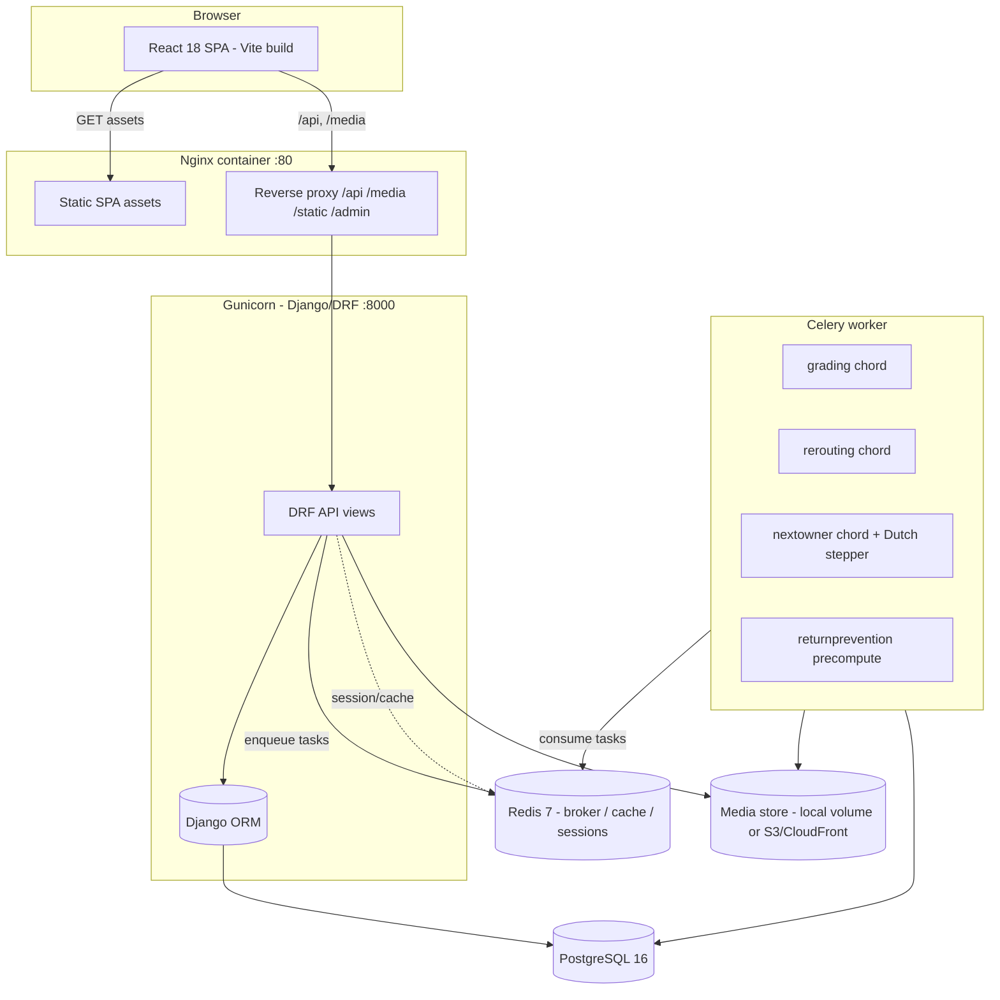
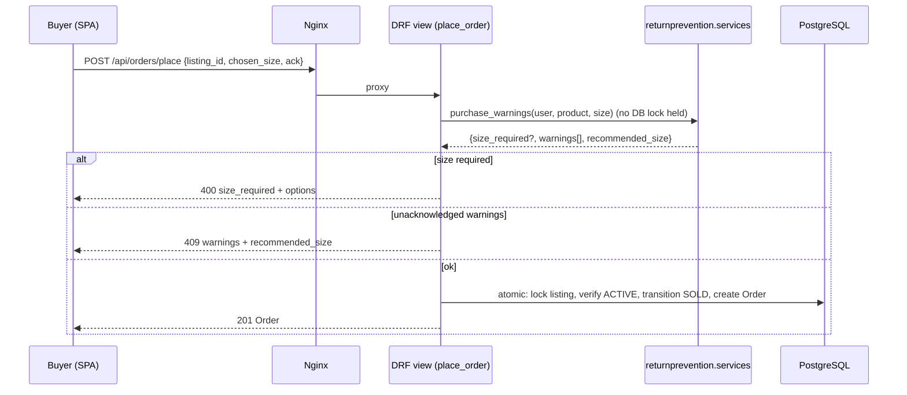
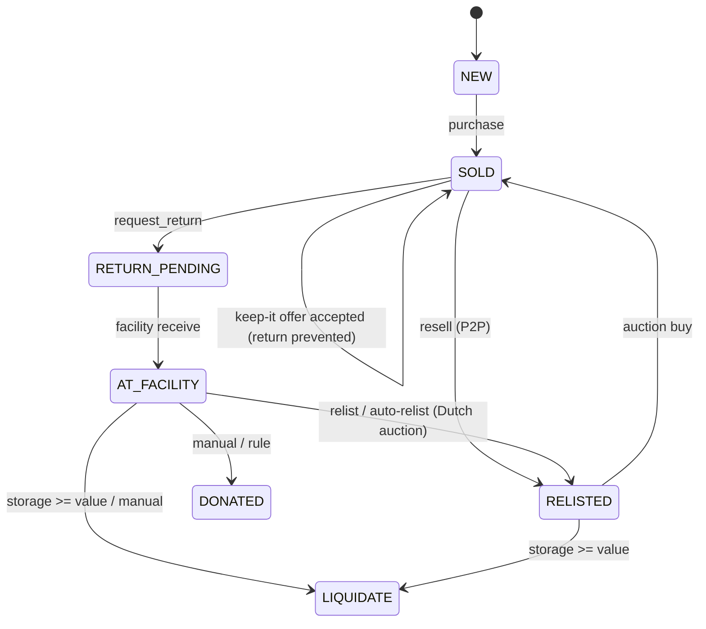

# Design Document

## Overview

Orbit is a full-stack platform that closes the loop on returned, unused, and outgrown products. Every physical item that enters the system is automatically graded for condition, priced, routed to its most profitable disposition, and matched to the buyer who wants it most — with green-credit incentives awarded at every sustainable touchpoint.

This document is the authoritative technical design for a clean, from-scratch build of the entire platform. It is written to be complete enough to build the system file-by-file. where a formula, weight, threshold, or default knob appears here it is the exact value the system ships with.

The platform is organized around one atomic concept: a single physical **ItemUnit** flows through its complete lifecycle (`NEW → SOLD → RETURN_PENDING → AT_FACILITY → RELISTED → SOLD` again, or `LIQUIDATE`/`DONATED`), accumulating an immutable, append-only **UnitEvent** trail that powers the buyer-facing Product Health Card.

Five engineering principles govern the whole system and are treated as cross-cutting requirements:

1. **No single source trusted.** Grading blends five independent signals with cross-source agreement and a decisive fraud floor.
2. **Graceful degradation everywhere.** Every AI call has a deterministic fallback; the system runs identically with zero API keys configured.
3. **Configuration over code.** Adding a provider, changing match weights, tuning the auction, adjusting fraud-risk discounts — all are settings changes.
4. **The unit is the atom.** One physical `ItemUnit` carries its entire lifecycle and an immutable event trail.
5. **Economics are explicit.** Every routing decision carries a per-route profit breakdown, the inputs that produced it, the realization probability, and the decision source.

### Roles

- **Buyer** (`BUYER`): shops, returns, and resells items. Buyers double as peer-to-peer sellers; no separate role is needed.
- **Seller** (`SELLER`): lists catalog products, manages a returned-unit inbox, and defines auto-disposition rules.
- **Facility operator** (`FACILITY`, admin-created only): receives, grades, relists, and monitors returned units; manages storage.
- **Platform/Admin**: configures business knobs, providers, and seed data via the Django admin.

### Six interconnected capabilities

1. **AI condition grading** — multi-source verdict from buyer photos (VLM + perceptual-hash/colour similarity + EXIF metadata + buyer history + reason-mismatch cross-check), blended with explicit weights and a "wrong item" fraud floor. Five fraud signals renormalized over available data. Target < 2s offline.
2. **Smart rerouting** — chooses `RESELL`/`REFURBISH`/`P2P`/`DONATE` per unit using a risk-adjusted expected-value model plus an LLM strategy; includes a "keep-it" return-prevention offer (partial cash + credits).
3. **Trust layer (Product Health Card)** — AI grade, confidence, calendar-accurate remaining warranty, full append-only event trail, and live price.
4. **Return prevention** — pre-purchase fit guide (declared sizes vs options) and accessory compatibility (LLM + deterministic rules), precomputed on login for zero buy-path latency.
5. **Peer-to-peer resale** — Next Best Owner 5-signal buyer matching + a self-rescheduling descending-price (Dutch) auction.
6. **Green credits** — earn/redeem currency awarded at every sustainable touchpoint; resale bonus grows as the Dutch price drops.

---

## Architecture

### System topology

The system is a React 18 SPA served as static assets behind Nginx, which reverse-proxies the API and media to a Gunicorn-hosted Django/DRF backend. Heavy AI work runs on a Celery worker that shares a media volume with the backend. PostgreSQL 16 is the system of record; Redis 7 is the Celery broker/result backend, the Django cache, and (via `cached_db`) the session store.



### Request data flow (synchronous)

Views stay thin: they validate input, call an engine/service module, and serialize. All decision logic lives in dedicated, HTTP-free modules.



### Async data flow (return → grading → rerouting)

The return path is the canonical async pipeline. A return triggers a grading chord (four parallel sources blended in a callback), and a completed `RETURN` assessment hands off to a rerouting chord (EV ∥ LLM blended in a finalize callback). No image bytes ever pass through the broker — each subtask reads images from storage by assessment id.

```mermaid
sequenceDiagram
    participant V as request_return view
    participant GS as grading.services
    participant Q as Redis broker
    participant W as Celery worker
    participant ROUTE as rerouting
    V->>GS: create_return_assessment(order, photos, exif)
    GS->>Q: run_assessment.delay(aid)
    Q->>W: run_assessment
    W->>W: chord[ vlm | similarity | metadata | history ] -> aggregate
    W->>W: aggregate(): blend scores, persist verdict, latency
    W->>ROUTE: decide_route.delay(aid)   (RETURN context only)
    ROUTE->>W: chord[ ev | llm ] -> finalize
    W->>W: finalize(): LLM authoritative else EV; maybe keep-it offer
```

The resale path mirrors this: a `RESALE` assessment hands off to `nextowner.price_and_match`, which precomputes the product vector and candidate-buyer demand profiles in parallel (chord), then prices, lists, matches, alerts tier 0, and schedules the first Dutch price step.

**Eager / inline fallback.** When `CELERY_TASK_ALWAYS_EAGER=1` (tests, no-broker demos) or when chord dispatch fails, every chord is replaced by inline sequential execution within one process, so a decision/verdict is always produced. In eager mode the Dutch auction does **not** auto-advance — the demo/test drives each price step explicitly.

### Lifecycle state machine (ItemUnit)



---

## Tech Stack and Cross-Cutting Conventions

### Stack

| Layer      | Technology                                                                                                                |
| ---------- | ------------------------------------------------------------------------------------------------------------------------- |
| Backend    | Django 5.x, Django REST Framework, Celery 5.3, PostgreSQL 16, Redis 7                                                     |
| Frontend   | React 18, Vite 5, React Router 6, vanilla CSS, `exifr` for client EXIF                                                    |
| AI/ML      | OpenAI SDK (Gemini 2.5 Flash / GPT-4o-mini compatible), `networkx` (bipartite matching), Pillow (perceptual hashing); `sentence-transformers` (MiniLM-L6-v2) optional — installed in Dockerfile only, not in `requirements.txt` |
| Infra      | Docker Compose, Gunicorn, Nginx, WhiteNoise, django-storages[s3]                                                          |
| Deployment | AWS-shaped (CloudFront + S3 static/media, EC2/ECS backend, RDS, ElastiCache)                                              |

### Cross-cutting conventions

- **Auth & sessions.** DRF `SessionAuthentication`; CSRF enforced on unsafe methods; default permission `IsAuthenticatedOrReadOnly`. Sessions use `django.contrib.sessions.backends.cached_db` so session storage scales by swapping the cache backend alone. Custom user model is `core.User` (`AUTH_USER_MODEL = "core.User"`). `SECURE_PROXY_SSL_HEADER = ("HTTP_X_FORWARDED_PROTO", "https")` so HTTPS is detected behind a proxy; `SECURE_COOKIES=1` marks session/CSRF cookies secure. `IsSeller` / `IsFacility` permissions gate role-specific endpoints.
- **Provider abstraction + registries.** Each AI capability follows a `providers/` package with a `base` interface, one module per backend, a deterministic `mock`, and a `registry` that resolves from settings, caches per process, and **never raises**. Auto-selection order is gemini → openai → modal, else mock. Adding a provider is a `LLM_PROVIDERS` settings entry, never a new call site.
- **Celery chord + inline fallback.** Heavy AI work fans independent sources out in parallel (`group`) and blends them in an aggregate/finalize callback (`chord`). Every subtask is wrapped in try/except and returns an empty partial rather than sinking the chord. Eager mode and dispatch failures run everything inline.
- **Configuration over code.** All business knobs live in `config/settings.py` and are env-overridable: storage rates, return windows, rerouting cost/risk factors, keep-it thresholds, match weights, recency half-life, auction params, pricing constants, credit awards.
- **Immutable event trail.** Every `ItemUnit`/`Listing`/`Order` transition appends an immutable `UnitEvent` via `StatefulItem.transition()`. Events are append-only, ordered by `created_at` ascending, and never edited or deleted. The Health Card is a direct read of this trail.
- **Money & time.** All money is integer ₹ (INR). `TIME_ZONE = "Asia/Kolkata"`, `USE_TZ = True`; timezone-aware datetimes throughout; `dateutil.relativedelta` for calendar-accurate warranty math.
- **Media.** Local volume by default; S3/CloudFront when `USE_S3=1`. Backend and worker share a media volume so grading reads uploaded photos without network round-trips.
- **Logging.** App loggers (`grading`, `rerouting`, `marketplace`, `services`, `facility`, `core`, `catalog`, `greencredits`, `nextowner`) surface at `LOG_LEVEL` (default INFO); third-party logs stay at WARNING.

---

## Components and Data Models

Each capability is a vertical-slice Django app. Models are the durable state; services/engines hold all decision logic (HTTP-free and unit-testable); views stay thin. This section documents every app's data models and the engine/service modules that operate on them.

### core — identity, auth primitives, shared base classes

**Models**

- `Roles(TextChoices)`: `BUYER`, `SELLER`, `FACILITY`.
- `User(AbstractUser)`: adds `role` (`Roles`, default `BUYER`), `profile` (JSON, default `{}` — e.g. `{"sizes": {"waist": "32", "top": "M", "shoe_uk": "9"}}`), `city` (str, blank), `lat`/`lng` (float, nullable). `AUTH_USER_MODEL = "core.User"`.
- `TimeStamped` (abstract): `created_at` (auto_now_add), `updated_at` (auto_now). Base for nearly every model.
- `StatefulItem(TimeStamped)` (abstract): `state` (str) + `state_changed_at`. `unit_ref()` returns the `ItemUnit` a subclass concerns (or `None`). `transition(new_state, actor=None, **payload)` flips the state, saves, and — when `unit_ref()` is non-null — appends a `UnitEvent` recording the new state as `type`, the prior state under `payload["from"]`, the originating class name under `payload["model"]`, the acting user, and any extra payload. This single method is the audit-trail invariant for `ItemUnit`, `Listing`, and `Order`.

**Modules**

- `permissions.py`: `IsSeller` (authenticated + `role == "SELLER"`), `IsFacility` (authenticated + `role == "FACILITY"`).
- `uploads.py`: shared photo handling. `ALLOWED_EXT = {.jpg,.jpeg,.png,.webp}`, `MAX_BYTES = 8 MiB`, `MAX_PHOTOS = 6`. `validate_image(f)` checks one file's extension (lowercased) and size, raising `ValueError` with a user-facing message (`"unknown"` when no extension). `save_photos(files, subdir)` enforces the 6-photo cap before persisting anything, validates each file, stores each under `<subdir>/<uuid4hex><ext>` via `default_storage`, and returns the media-relative paths in upload order.
- `views.py`: `register` (role-check → presence-check → uniqueness-check ordering; 400/409 as appropriate; `create_user`, `login`, best-effort precompute, 201), `login_view` (401 on bad creds, else session + precompute + payload), `logout_view` (204), `me` (`{"user": payload|null}`, always 200). `_user_payload` includes id, username, role, email, names, city, lat, lng, profile, date_joined, and `green_credits.balance` (default 0 when no account). `_precompute_return_prevention` enqueues `returnprevention.tasks.precompute_for_user` and swallows broker errors.
- `management/commands/seed_demo.py`: idempotent demo seed (guards on `username="seller1"`). Creates buyers (`buyer1`/Delhi, `rahul`/Mumbai, plus 8 named extra buyers spread across `rerouting.geo.CITY_COORDS`), a `seller1`, a `facility1`, an `admin` superuser, size profiles, a rich 25-product catalog (real photos from `images/` with a generated branded-placeholder fallback), `NEW` listings per stock unit, units seeded across lifecycle states, seller rules, demo orders, and starting green-credit balances; calls `seed_rewards()` unconditionally. `refresh_product_images.py` re-attaches catalog photos.

### catalog — Product, ItemUnit, immutable event trail, warranty

**Models**

- `ProductOrigin(TextChoices)`: `PLATFORM` (has reference image; grading compares), `EXTERNAL` (no reference; grading runs in VLM anomaly/quality mode).
- `Product(TimeStamped)`: `title`, `description`, `category`, `mrp` (PositiveInteger ₹), `image` (ImageField `products/`, optional), `origin` (default `PLATFORM`), `attributes` (JSON, default `{}`), `seller` (FK User). Indexed on creation order via default queries.
- `UnitStates(TextChoices)`: `NEW`, `SOLD`, `RETURN_PENDING`, `AT_FACILITY`, `RELISTED`, `LIQUIDATE`, `DONATED`.
- `ItemUnit(StatefulItem)` — the central atom: `product` (FK), `grade` (A/B/C/D, nullable), `grade_confidence` (float, nullable), `untouched` (bool, default false), `est_value` (PositiveInteger ₹, nullable), `purchased_at` (datetime, nullable — warranty anchor), `arrived_at_facility` (datetime, nullable), `storage_cost_accrued` (PositiveInteger ₹, default 0), `owner` (FK User, SET_NULL). `save()` defaults blank `state` to `NEW`; `unit_ref()` returns `self`; indexed on `state`.
- `UnitEvent(TimeStamped)`: `unit` (FK), `type` (str), `payload` (JSON), `actor` (FK User, SET_NULL). `Meta.ordering = ["created_at"]` (ascending). Append-only; no edit/delete path is exposed anywhere.

**Modules**

- `warranty.py`: `warranty_expiry(purchased_at, text)` parses the first `(\d+)\s*(year|month|week|day)` (case-insensitive) from the warranty string; returns `None` when no purchase date, no/blank/non-string text, no match, or `qty <= 0`. Years/months use `relativedelta` (calendar-accurate, same day-of-month); weeks/days use `timedelta`. `warranty_remaining_label(product, purchased_at)` reads `attributes["warranty"]`, returns `None` if expired/unanchored, floors to whole years when `>= 1` year remains, else to whole months, and returns `None` rather than render `"0 months"`.
- `views.py`: `product_list` (newest first, optional `q` icontains over title/description, optional exact `category`, cap 60), `product_detail` (product + ACTIVE listings, 404 if missing), `product_related` (≤12 same-category, newest, excluding self, 404 if missing), `unit_health_card` (public; serializes the unit with `include_routing=False` so the internal disposition is hidden, attaches `current_price` from the active auction else the active listing, and `warranty_remaining`), `preloved_list` (active `ResaleAuction` cards with per-user `recommended` flag from `MatchEdge`), `product_fitcheck` (legacy `services.ai.fit_check`).
- `serializers.py`: `ProductSerializer` (with `image_url`/`thumbnail_url`; thumbnail falls back to the first photo of the newest ACTIVE listing, else null), `UnitEventSerializer`, `ItemUnitSerializer` (nested product + events + `routing_recommendation`, the latter dropped when `include_routing` is False).

### marketplace — Listing, Order, purchase, return flow, return-window policy

**Models**

- `ListingSources`: `NEW`, `FACILITY_RELIST`, `USER_RESALE`, `SELLER_RETURN`. `ListingStates`: `ACTIVE`, `RESERVED`, `SOLD`, `WITHDRAWN`.
- `Listing(StatefulItem)`: `unit` (FK, not OneToOne — the same physical unit is relisted across owners; the "≤1 ACTIVE/RESERVED per unit" invariant is enforced in code), `source`, `price` (PositiveInteger ₹), `band_lo`/`band_hi` (nullable PositiveInteger), `photos` (JSON list of media paths), `lister` (FK User, SET_NULL). `save()` defaults to `ACTIVE`; `unit_ref()` returns `self.unit`; indexed on `(state, source)`.
- `OrderStates`: `PLACED`, `DELIVERED`, `RETURN_REQUESTED`, `RETURN_RECEIVED`, `REFUNDED`, `SETTLED`, `PREVENTED`. `ReturnReasons`: `DIDNT_MATCH`, `WRONG_SIZE`, `CHANGED_MIND`, `DEFECTIVE`, `OTHER`.
- `Order(StatefulItem)`: `buyer` (FK), `listing` (FK), `chosen_size` (str, blank), `return_reason` (choice, blank), `claimed_untouched` (bool), `photos` (JSON return-time photos), `return_comment` (text), `delivered_at` (datetime — return-window anchor). `save()` defaults to `PLACED`; `unit_ref()` returns `self.listing.unit`; indexed on `state`.

**Modules**

- `returns.py` (return-window policy): `return_window_days(category)` reads `RETURN_WINDOW_DAYS_BY_CATEGORY` (case-insensitive) with global `RETURN_WINDOW_DAYS` default (7). `return_deadline(order)` anchors on `delivered_at` (falling back to `created_at`) + window days. `buyer_started_resale(order)` is true once a `ResaleRequest` exists for this `(unit, buyer)`. `is_return_eligible(order)` is false once resold, else true while `now <= deadline`.
- `views.py`: `place_order` — runs `returnprevention.purchase_warnings` **outside** any lock (400 `size_required`, 409 warnings unless `ack`); delegates auction-backed listings to `nextowner.auction.buy`; otherwise an atomic block `select_for_update`s the ACTIVE listing (409 if gone, 409 if buyer already owns), transitions listing+unit to `SOLD`, sets owner, creates the order, and awards credits (20 USER_RESALE + a `PICKUP_SCHEDULED` event, 25 FACILITY_RELIST). `my_orders` (buyer's own, newest first). `request_return` — 404/409 gates (not DELIVERED, already resold, window closed with `resell_available`+deadline), reason coercion to `OTHER`, photo validation, per-photo client EXIF parsed from JSON `metadata`, transitions order→`RETURN_REQUESTED` and unit→`RETURN_PENDING`, best-effort `create_return_assessment` and 5-credit untouched award (both log-and-continue on failure). `advance_order` (demo single-step PLACED→DELIVERED [stamps `delivered_at`] / RETURN_REQUESTED→RETURN_RECEIVED, else 409).
- `serializers.py`: `photo_urls()` (paths→URLs, tolerant of bad paths), `ListingSerializer`, `OrderSerializer` (computed `return_eligible`, `return_deadline`, and `prevention_offer` from the latest pending `ReturnOffer`).

### grading — multi-source AI condition grading

**Models**

- `AssessmentContext`: `RETURN`, `RESALE`, `FACILITY`. `AssessmentStatus`: `PENDING`, `RUNNING`, `DONE`, `FAILED`. `ImageRole`: `UPLOADED`, `REFERENCE`.
- `GradingAssessment(TimeStamped)`: `unit` (FK), `order` (FK marketplace.Order, SET_NULL, nullable), `triggered_by` (FK User), `context` (default `RETURN`), `status` (default `PENDING`), resolved `vlm_provider`/`embedding_provider`, raw per-source signals `vlm_result`/`similarity`/`metadata_findings`/`history_signals` (JSON, kept verbatim for re-scoring), blended `quality_score`/`fraud_score`/`confidence` (floats in [0,1]), `suggested_grade` (A/B/C/D), explainable `scores` (JSON), `error`, `latency_ms`. Indexed on `(unit, status)`, `status`, `-created_at`; ordered newest first.
- `GradingImage(TimeStamped)`: `assessment` (FK), `path`, `role`, `client_metadata` (pre-compression EXIF), `server_metadata` (derived from bytes), `phash`, `embedding_ref`, `vlm_notes`, `quality`. Indexed on `(assessment, role)`.

**Engine modules**

- `services.py`: `create_return_assessment(order, uploaded_paths, client_metadatas)` builds a PENDING assessment, records buyer photos as `UPLOADED` (with index-aligned client EXIF) and listing photos + product image as `REFERENCE`, then enqueues `run_assessment` (swallowing broker errors). `create_resale_assessment(unit, uploaded_paths, reference_paths, triggered_by)` does the same for a `RESALE` context (no order; empty references → anomaly/quality mode). `_reference_paths` collects listing photos + the product image name.
- `orchestrator.py`: per-source runners keyed by assessment id so each can be a Celery subtask or run inline. `run_vlm` builds a `VLMRequest` (product context + buyer claim + uploaded + reference images), resolves the VLM provider, falls back to the mock on any error (recording provider `"mock"`), and persists per-image VLM notes/quality. `run_similarity` runs the embedding provider, persists per-image phashes. `run_metadata` derives server metadata and analyzes client EXIF against `order.delivered_at`. `run_history` summarizes buyer history. `aggregate(aid, partials)` merges partials, calls `scoring.blend`, persists the verdict + `latency_ms` (now − created_at), sets `DONE`, persists grader-derived attributes onto the product (real VLM only), and hands off: `RETURN`→`rerouting.decide_route`, `RESALE`→`nextowner.price_and_match` (both best-effort). `run_all_sync` runs all four sources then aggregates inline (eager/test/fallback). `_persist_grader_attributes` merges `size_class`/`fragility`/`category` onto the product only for a real VLM and only when changed.
- `scoring.py`: `blend(vlm, similarity, metadata, history, claim)` → `{quality_score, fraud_score, confidence, suggested_grade, scores}`. Quality = clamped VLM `quality_estimate`. Five fraud signals (VLM = 0.0/0.6 on match + 0.15·flags capped +0.4; similarity = `(0.6−overall)/0.6` clamped, +0.3 on duplicates; metadata; history; reason-mismatch via `_reason_mismatch`). Weights `vlm 0.30, similarity 0.25, metadata 0.20, history 0.15, reason_mismatch 0.10`, renormalized over present signals. Decisive override: a **real** VLM, `item_matches_reference=False`, confidence ≥ 0.6 floors fraud at 0.6. Confidence blends VLM self-confidence (×0.6 if not real), signal availability, and cross-source agreement (1 − stdev). Grade = the worse of the VLM grade and the quality-derived grade (`≥0.85→A, ≥0.6→B, ≥0.35→C, else D`).
- `history.py`: `analyze(buyer_id, exclude_order_id)` → return-rate/velocity signal in [0,1]; capped at 0.3 when `< 3` prior orders, else `0.6·min(rate,1) + 0.4·min(recent_30d/3,1)`; never raises.
- `metadata.py`: `server_metadata_from_bytes` (width/height/format/has_exif via Pillow); `analyze_image(client, server, reference_time)` raises weighted flags (`stale_capture 0.5`, `future_capture 0.5`, `software_edited 0.4`, `dimension_mismatch 0.4`, `is_screenshot 0.35`, `no_capture_time 0.15`, `no_camera_exif 0.15`, `low_resolution 0.1` below 230,400 px), each image weight clamped to [0,1]; `summarize` blends to `0.6·worst + 0.4·mean`.
- `prompts.py`: `SYSTEM_PROMPT` + `_OUTPUT_SHAPE`, `grade_schema()` (strict json_schema), `build_vlm_messages` (text + base64 `image_url` parts), `normalize_vlm_output` (coerces to the stable schema; tolerates garbage; grade letter must stand alone).
- `tasks.py`: `run_assessment` (eager → `run_all_sync`; else set RUNNING and dispatch a `chord` of `vlm/similarity/metadata/history` subtasks into `aggregate_subtask`, falling back to inline on dispatch failure). Each subtask wraps its runner in `_safe` and returns `{}` on error so it never sinks the chord.

**Providers** (`providers/`)

- `base.py`: `GradingImageData`, `VLMRequest`, abstract `VLMProvider.grade`, `EmbeddingProvider.compare`.
- `openai_compat.py`: `OpenAICompatVLM` — one OpenAI-SDK client for Gemini/OpenAI/Modal; sends json_schema (degrades to json_object per model), strips `reasoning_effort` per model when a 400 says thinking is unsupported (remembering both per process so each knob costs at most one round-trip).
- `bedrock.py`: stub (`NotImplementedError`). `modal.py`: optional CLIP embedding (falls back to phash). `mock.py`: `MockVLM` — deterministic, reason-aware verdicts seeded by product+reason, derives `size_class`/`fragility` from keywords; provider name `"mock"`.
- `phash.py`: `PHashEmbedding` — 64-bit dHash + coarse RGB colour histogram (colour weight 0.45); `compare` returns `overall` (best uploaded↔reference combined similarity), per-image phashes, duplicate pairs at dHash ≥ 0.96; caches reference signatures.
- `registry.py`: `get_vlm_provider()` / `get_embedding_provider()` resolve from settings, cache nothing that raises, and **never raise** — auto order gemini→openai→modal else mock; `_is_usable` requires a model plus either an api_key or a keyless self-hosted base_url.

### rerouting — disposition engine (EV ∥ LLM) + keep-it offer

**Models**

- `RouteChoices`: `RESELL`, `REFURBISH`, `P2P`, `DONATE`. `DecisionStatus`/`StrategyKinds` (`llm`/`ev`). `OfferStatus`: `PENDING`/`ACCEPTED`/`DECLINED`.
- `RouteDecision(TimeStamped)`: `assessment` (OneToOne, SET_NULL), `order` (FK), `unit` (FK), `status`, final `route`+`decided_by`+`confidence`+`reasoning`, audited `ev_route`/`llm_route`, deterministic `costs` (JSON per-route breakdown) and `context` (JSON inputs), `error`. Ordered newest first.
- `ReturnOffer(TimeStamped)`: `decision` (OneToOne), `order` (FK), `status`, `cash_refund` (₹), `green_credits`, `expected_loss` (₹ avoided), `company_cost` (₹), `message`, `responded_at`.

**Modules**

- `costs.py`: risk-adjusted profit per route. `rate_per_km = RATE_PER_KM[size] · FRAGILITY_MULT[fragility]`. `repair_cost = (1−q)·MRP·REPAIR_FACTOR` capped at `REPAIR_MAX_PCT·MRP`. `sell_through(q) = base + (1−base)·q`. `_realize = sell_through(q)·(1 − fraud·fraud_weight)`. `compute(...)` charges two inter-city legs for RESELL/REFURBISH, two local legs for P2P, one local for DONATE; revenue = nominal value × realization; returns `{routes, inputs}`.
- `optimizer.py`: `optimize(costs)` argmax profit → `{route, profit, loss, ranking}`.
- `strategies.py`: `build_context(assessment)` snapshots quality/fraud/size/fragility/grade/est_value/paid/distance/storage/reason/defects/histories into plain dicts and calls `costs.compute`. `ev_result` (deterministic) and `llm_result` (authoritative when it answers). `finalize(decision, ev, llm_out)` blends (LLM wins if present, else EV with generated reasoning), persists, then `maybe_offer`. `maybe_offer` creates a keep-it offer only when `loss > 0`, `fraud ≤ REROUTING_OFFER_FRAUD_MAX (0.3)`, `quality ≥ REROUTING_OFFER_MIN_QUALITY (0.4)`: `make_whole = min(paid·(1−q), loss)`, `cash = 0.6·make_whole`, `credits = make_whole − cash`, `company_cost = cash + 0.9·credits`.
- `geo.py`: `CITY_COORDS` (10 Indian centroids), `FACILITY_CITY = "Bengaluru"`, `haversine_km(a, b)`, `coords_for(user)` (explicit lat/lng → city → None), `distance_between(seller, buyer)` (facility fallback per side).
- `llm.py`: `decide(context, cost)` resolves an OpenAI-compatible provider (auto/named, else None → EV), builds messages, parses with `grading.jsonio.extract_json`, validates the route ∈ {RESELL,REFURBISH,P2P,DONATE}, degrades json_schema→json_object per model.
- `prompts.py`: `SYSTEM_PROMPT`, `build_messages` (item + per-route profit lines + logistics), `decision_schema` (strict `{route, confidence, reasoning}`).
- `services.py`: `recommendation_for(unit)` (latest DONE decision shaped for the facility UI), `ensure_recommendation_for(unit)` (computes inline from the latest DONE assessment — running grading inline if needed — when the async chain hasn't produced one), `_shape_recommendation`, `latest_offer`, transactional `accept_offer` (awards real credits, order→`PREVENTED`, unit stays `SOLD` with buyer) and `decline_offer` (records decline; normal return proceeds).
- `tasks.py`: `decide_route(assessment_id)` builds the decision then runs EV ∥ LLM as a chord into `finalize_subtask` (inline in eager mode); `decide_route_now` is the synchronous variant used by facility intake; subtasks return empty partials on error.
- `views.py`: `accept_offer`/`decline_offer` (owner-checked, 404 otherwise).

### nextowner — Next Best Owner P2P resale (matching + Dutch auction)

**Models**

- `DemandProfile(TimeStamped)`: OneToOne `user`, `taste_vector` (JSON, recency-weighted bought-product embeddings), `dim`, `category_affinity`/`brand_affinity` (normalized histograms), `price_mean`/`price_std` (₹ budget), `green_propensity` (0..1), `n_orders`, `provider`.
- `ProductVector(TimeStamped)`: OneToOne `product`, `text_vector` (JSON), `dim`, `provider`.
- `ResaleStatus`: `PENDING`/`PRICED`/`FAILED`. `ResaleRequest(TimeStamped)`: `seller` (FK), `unit` (FK), `photos`, `original_price` (₹ paid or declared), `age_months`, `linked` (bool — bought on platform), `assessment` (FK SET_NULL), `listing` (FK SET_NULL), `status`. Created PENDING before grading; the handoff finds it by unit and flips to PRICED.
- `AuctionStatus`: `PENDING`/`ACTIVE`/`SOLD`/`EXPIRED`. `ResaleAuction(TimeStamped)`: OneToOne `listing`, `unit` (FK), `seller` (FK), `ceiling`/`floor`/`current_price` (₹), `step_pct`, `interval_seconds`, `tier`, `max_tier`, `status`, `next_step_at`, `buyer` (FK SET_NULL winner), `pricing` (JSON snapshot).
- `MatchStatus`: `SENT`/`VIEWED`/`PURCHASED`/`EXPIRED`. `MatchEdge(TimeStamped)`: `auction` (FK), `buyer` (FK), `score`, `components` (per-term breakdown), `tier`, `rank`, `status`, `alerted`, `price_at_alert`, `green_credit_bonus`. Unique `(auction, buyer)`; ordered by `(auction_id, rank)`.

**Modules**

- `embeddings.py`: `embed_text(s)`/`embed_texts`/`provider_name`, plus numpy-free `cosine`, `cosine01` (remap to [0,1]), `weighted_mean` (recency-weighted unit vector).
- `products.py`: `product_text(product)` (title + category + brand + description + remaining scalar attributes), `build_product_vector`/`get_product_vector` (cache, rebuild on provider change).
- `profiles.py`: `build_demand_profile(user)` (recency half-life from settings; taste = weighted mean of bought-product vectors; normalized category/brand affinity; price mean/std; `green_propensity = 0.6·preloved_ratio + 0.4·min(earned/200,1)`), `get_demand_profile` (cached, rebuild on provider change; cold-start = neutral).
- `pricing.py`: `price_resale(...)` → `est_value = P0 · [ρ_min + (ρ_max−ρ_min)·q^γ] · (1−d_cat)^months · (1 − λ·fraud)` with band `est·(1 ± band_width·(1−confidence))`; `depreciation_factor(category, months)`; `auction_bounds(est)` = `{ceiling = est·1.25, floor = est·0.70}` (premium 0.25 / reserve discount 0.30, deliberately wider than the band).
- `matching.py`: `score_edge(profile, product, vec, price, grade)` = `0.45·semantic + 0.20·category + 0.20·price_fit + 0.10·quality_fit + 0.05·green` (cold-start semantic = 0.5; `_price_fit` is a Gaussian budget kernel; `_GRADE_FIT` A=1.0,B=0.8,C=0.55,D=0.3). `candidate_buyers(_for)` (role BUYER, excluding seller/owner, optional city), `build_match_graph` (networkx bipartite), `top_buyers(listing, k)` (ranked, tagged with `rank` and `tier = rank // tier_size`).
- `auction.py`: pure Dutch-auction core. `credit_bonus_at(auction, price)` (0 at ceiling → `CREDIT_MAX_BONUS (40)` at floor). `start_auction_for_assessment(assessment)` (prices the PENDING resale request, sets unit grade/est_value, creates a `USER_RESALE` listing at the ceiling, transitions unit→`RELISTED`, creates the ACTIVE auction, persists ranked edges, alerts tier 0, flips the request to PRICED). `open_auction_for_unit(...)` (synchronous relist for already-graded units — facility/seller — where `actor` becomes owner+lister). `step(auction)` (lowers price by `step_pct`, widens to the next tier, refreshes bonuses, expires only at floor **and** last tier). `buy(auction_id, buyer)` (row-locked: transfers unit, creates order, awards `CREDIT_BASE (20)` + price-drop bonus to buyer and `SELLER_RESELL_CREDIT (30)` to seller, emits a `PAYOUT_RELEASED` event at 92%). `rematch(auction)` (rebuild edges + re-alert tiers).
- `services.py`: `start_resale_from_order` (linked: reuses unit + paid price + catalog reference image, anchors `purchased_at`, settles the originating order), `start_resale_external` (creates an EXTERNAL product+unit, no reference), `open_relist_auction` (wraps `open_auction_for_unit` + best-effort step scheduling).
- `tasks.py`: parallel embedding precompute (`build_product_vector_task`, `build_demand_profile_task`, `precompute_vectors`), the grading→pricing handoff `price_and_match` (chord: precompute product vector + candidate buyer profiles in parallel, then `finalize_match` → `start_auction_for_assessment` → schedule first step), the self-rescheduling `step_auction` (skips guard with `force`), and the demo `run_demo_match`/`rematch_auctions`. Eager mode runs inline and does **not** auto-advance the auction.
- `views.py`: `resell` (GET my auctions; POST multipart — `order_id` linked resale or external item fields), `alerts` (this buyer's alerted active auctions, marks SENT→VIEWED), `auction_detail`, `buy`, `step` (demo force), and the demo surface `demo_products`/`demo_match`/`demo_results`.
- `serializers.py`: `MatchEdgeSerializer`, `AuctionSerializer` (card incl. `green_credits = base + bonus`), `AuctionDetailSerializer` (adds ranked edges).

### returnprevention — pre-purchase fit guide + accessory compatibility

No models — verdicts are cached in Redis and consumed by the buy path.

**Modules**

- `services.py`: `fit_guide(user, product)` (instant; reads `User.profile["sizes"]` and the product's `size_type`/`size_options`; `_closest` picks the nearest option — ordinal for `top`, numeric otherwise). `get_compat(user, product)` (only for accessories carrying `compatible_model`; cached per `(user, product)`; LLM with deterministic `rules` fallback; a final deterministic guard suppresses any warning unless the shopper actually owns a same-family device that doesn't fit). `owned_devices(user)` (distinct device models from order history). `accessory_product_ids()` (bounded precompute target). `purchase_warnings(user, product, chosen_size)` (combined gate → `{size_required, recommended_size, size_options, warnings[]}`).
- `rules.py`: `_split(model)` → `(family, variant)`; `_family_conflict` returns a conflicting owned device or None (warns only on same family + variant mismatch); `check_compat`/`has_family_conflict`.
- `llm.py`: `check_compat(product, target_model, owned)` (OpenAI-compatible; returns None on no-provider/failure → rules fallback; json_schema→json_object degrade).
- `tasks.py`: `compute_compat_task(user_id, product_id)` and `precompute_for_user(user_id)` (login fan-out over accessory product ids; eager inline).
- `views.py`: `product_fitguide` (per-user size recommendation; warms the compat cache in the background for accessories).

### greencredits — currency, transactions, rewards store

**Models**

- `GreenCreditAccount(TimeStamped)`: OneToOne `user`, `balance` (PositiveInteger).
- `CreditTransaction(TimeStamped)`: `account` (FK), `amount` (int; + earn / − spend), `type`, `description`, `reference_id`.
- `Reward(TimeStamped)`: `title`, `description`, `cost`, `icon`, `active`.
- `RewardClaim(TimeStamped)`: `user` (FK), `reward` (FK), `credits_spent`.

**Modules**

- `logic.py`: `award_credits(user, amount, type, description, reference_id=None)` (get-or-create account, add balance, record a transaction; no-op for a null user — the universal earn helper used across marketplace/rerouting/nextowner/facility/seller). `DEFAULT_REWARDS` + idempotent `seed_rewards()`.
- `views.py`: `credits_balance` (balance + impact stats + totals), `credits_history` (last 50), `rewards_list` (active), `claim_reward` (atomic; 400 when insufficient, else debit + transaction + `RewardClaim`).

### sellerportal — catalog management + auto-disposition rules

**Models**

- `RuleActions`: `AUTO_RELIST`, `LIQUIDATE`, `DONATE`. `SellerRule(TimeStamped)`: `seller` (FK), `min_grade` (default "B"), `min_recovery_pct` (default 60), `action`, `active`. `matches(unit)` is true when the unit has a grade + est_value + nonzero MRP, the grade is at least `min_grade` (via `GRADE_ORDER`), and `est_value·100 // mrp ≥ min_recovery_pct`.

**Modules**

- `views.py` (all `IsSeller`): `products` (GET my catalog; POST multipart create with validated image + initial stock, each stock unit getting a `NEW` listing). `returns_inbox` (AT_FACILITY units for my products + the first matching rule's suggested action). `apply_action` (single unit; `AUTO_RELIST` → `_relist_unit` opening a Dutch auction via `nextowner.open_relist_auction`, `LIQUIDATE`/`DONATE` via `transition`; DONATE awards 15 credits). `bulk_apply` (runs all active rules across the inbox, returns handled/remaining counts). `rules`/`rule_detail` (CRUD).

### facility — storage engine, intake, relist, watchlist

No models — operates on `catalog.ItemUnit` and `marketplace.Listing`.

**Modules**

- `engine.py` (storage clock, shared by the cron command and the demo endpoint): `daily_rate(category)` from `STORAGE_DAILY_RATE_BY_CATEGORY`/default. `accrue_one_day(actor)` advances every AT_FACILITY/RELISTED unit's `storage_cost_accrued`, liquidates (withdrawing the active listing, transition→`LIQUIDATE`) when accrued ≥ est_value, else steps price down `−PRICE_STEPDOWN_PCT%` every `PRICE_STEPDOWN_EVERY_DAYS` "days" (floored at `band_lo`, emitting a `PRICE_STEPDOWN` event); returns counts.
- `views.py` (all `IsFacility`): `incoming` (RETURN_PENDING units), `receive` (records untouched + `arrived_at_facility`, prefers the latest DONE assessment grade else the legacy `ai.grade`, prices via `ai.price`, transitions→`AT_FACILITY`, computes/stores a `ROUTING_RECOMMENDATION` via `ensure_recommendation_for`, marks the originating order `REFUNDED`), `relist` (opens a Dutch auction via `open_relist_auction` with the facility as owner+lister; 409 if already listed), `watchlist` (units ranked by storage-cost÷value, closest to liquidation first), `dispose` (manual LIQUIDATE/DONATE), `simulate_day` (demo wrapper around `accrue_one_day`).
- `management/commands/accrue_storage.py`: the daily facility clock (same `accrue_one_day`).

### services/ai — legacy deterministic helpers

## A network-free mock grader/pricer (`ai.grade`, `ai.price`, `ai.fit_check`) retained for back-compat and as the fallback grader at facility intake when no multi-source assessment completed. Gated by `AI_MOCK`.

## API Endpoints

All routes are mounted in `config/urls.py`. Auth posture follows the global DRF default `IsAuthenticatedOrReadOnly` unless a view overrides it; the API is session-authenticated with CSRF enforced on unsafe methods. "Public" below means `AllowAny`/read-only; "Auth" means any authenticated user; "Seller"/"Facility" mean the role permission.

### Auth — `core.urls` under `/api/auth/`

| Method | Path                 | Access | Behavior                                                                                                             |
| ------ | -------------------- | ------ | -------------------------------------------------------------------------------------------------------------------- |
| POST   | `/api/auth/register` | Public | Create a BUYER/SELLER (role-check → presence → uniqueness; 400/409), log in, enqueue precompute, 201 + user payload. |
| POST   | `/api/auth/login`    | Public | Authenticate; 401 on bad creds, else session + precompute + 200 user payload.                                        |
| POST   | `/api/auth/logout`   | Auth   | Terminate session, 204.                                                                                              |
| GET    | `/api/auth/me`       | Public | 200 `{user: payload}` when authenticated, else `{user: null}`.                                                       |

### Catalog — `catalog.urls` under `/api/`

| Method | Path                          | Access | Behavior                                                                                           |
| ------ | ----------------------------- | ------ | -------------------------------------------------------------------------------------------------- |
| GET    | `/api/products`               | Public | Products newest-first; optional `q` (title/description icontains) and exact `category`; cap 60.    |
| GET    | `/api/products/<id>`          | Public | Product + its ACTIVE listings; 404 if missing.                                                     |
| GET    | `/api/products/<id>/related`  | Public | ≤12 same-category products, newest, excluding self; 404 if missing.                                |
| GET    | `/api/units/<id>/healthcard`  | Public | Public Health Card: unit + grade + event trail + live price + remaining warranty (routing hidden). |
| GET    | `/api/listings/preloved`      | Public | Active resale-auction cards; optional `category`/`grade`/`q`; per-user `recommended` flag.         |
| GET    | `/api/products/<id>/fitcheck` | Public | Legacy deterministic fit hint.                                                                     |

### Marketplace — `marketplace.urls` under `/api/`

| Method | Path                       | Access | Behavior                                                                                                                                              |
| ------ | -------------------------- | ------ | ----------------------------------------------------------------------------------------------------------------------------------------------------- |
| GET    | `/api/orders`              | Auth   | The buyer's own orders, newest first.                                                                                                                 |
| POST   | `/api/orders/place`        | Auth   | Buy a listing: pre-purchase guard (400 size / 409 warnings), auction delegation, else atomic row-locked NEW purchase (+credits). 409 on inactive/own. |
| POST   | `/api/orders/<id>/return`  | Auth   | Request a return on a DELIVERED, in-window, not-resold order; validates photos + EXIF, starts grading, awards untouched credit. 404/400/409 gates.    |
| POST   | `/api/orders/<id>/advance` | Auth   | Demo single-step forward (PLACED→DELIVERED / RETURN_REQUESTED→RETURN_RECEIVED); 409 if no step.                                                       |

### Seller portal — `sellerportal.urls` under `/api/seller/`

| Method       | Path                        | Access | Behavior                                                                                           |
| ------------ | --------------------------- | ------ | -------------------------------------------------------------------------------------------------- |
| GET/POST     | `/api/seller/products`      | Seller | List my catalog / create a product (multipart, validated image) with initial stock + NEW listings. |
| GET          | `/api/seller/returns`       | Seller | AT_FACILITY units for my products + suggested rule action.                                         |
| POST         | `/api/seller/returns/apply` | Seller | Apply an action to one unit (AUTO_RELIST/LIQUIDATE/DONATE; DONATE +15 credits).                    |
| POST         | `/api/seller/returns/bulk`  | Seller | Run all active rules across the inbox; returns handled/remaining.                                  |
| GET/POST     | `/api/seller/rules`         | Seller | List / create auto-disposition rules.                                                              |
| PATCH/DELETE | `/api/seller/rules/<id>`    | Seller | Update / delete a rule (204 on delete).                                                            |

### Facility — `facility.urls` under `/api/facility/`

| Method | Path                               | Access   | Behavior                                                                                                                             |
| ------ | ---------------------------------- | -------- | ------------------------------------------------------------------------------------------------------------------------------------ |
| GET    | `/api/facility/incoming`           | Facility | Units in RETURN_PENDING awaiting receipt.                                                                                            |
| POST   | `/api/facility/receive`            | Facility | Scan-in: verify untouched, grade (assessment-preferred), price, start storage clock, store routing recommendation, refund the order. |
| POST   | `/api/facility/units/<id>/relist`  | Facility | Open a Dutch auction for an AT_FACILITY unit; 409 if already listed.                                                                 |
| POST   | `/api/facility/units/<id>/dispose` | Facility | Manual LIQUIDATE/DONATE; withdraws any active listing.                                                                               |
| GET    | `/api/facility/watchlist`          | Facility | Units ranked by storage-cost÷value (closest to liquidation first).                                                                   |
| POST   | `/api/facility/simulate-day`       | Facility | Demo: advance the storage clock one day (same code as the cron).                                                                     |

### Rerouting — `rerouting.urls` under `/api/rerouting/`

| Method | Path                                 | Access       | Behavior                                                                                           |
| ------ | ------------------------------------ | ------------ | -------------------------------------------------------------------------------------------------- |
| POST   | `/api/rerouting/offers/<id>/accept`  | Auth (owner) | Accept a keep-it offer: award real credits, order→PREVENTED, unit stays with buyer. 404 otherwise. |
| POST   | `/api/rerouting/offers/<id>/decline` | Auth (owner) | Decline; the normal return proceeds. 404 otherwise.                                                |

### Next Best Owner — `nextowner.urls` under `/api/nextowner/`

| Method   | Path                                | Access | Behavior                                                                                             |
| -------- | ----------------------------------- | ------ | ---------------------------------------------------------------------------------------------------- |
| GET/POST | `/api/nextowner/resell`             | Auth   | GET my resale auctions / POST list an item (multipart: `order_id` linked, or external item fields).  |
| GET      | `/api/nextowner/alerts`             | Auth   | This buyer's alerted active auctions (best fit first); marks SENT→VIEWED.                            |
| GET      | `/api/nextowner/auctions/<id>`      | Auth   | Auction detail + ranked buyer edges.                                                                 |
| POST     | `/api/nextowner/auctions/<id>/buy`  | Auth   | Buy at the current Dutch price; awards base + price-drop bonus, releases payout. 409 if not buyable. |
| POST     | `/api/nextowner/auctions/<id>/step` | Auth   | Demo: force one descending price step.                                                               |
| GET      | `/api/nextowner/demo/products`      | Auth   | All resale auctions (demo grid).                                                                     |
| POST     | `/api/nextowner/demo/match`         | Auth   | Precompute embeddings in parallel and (re)match active auctions.                                     |
| GET      | `/api/nextowner/demo/results`       | Auth   | Poll target: auctions with top buyers + live price/tier.                                             |

### Return prevention — `returnprevention.urls` under `/api/`

| Method | Path                          | Access | Behavior                                                                          |
| ------ | ----------------------------- | ------ | --------------------------------------------------------------------------------- |
| GET    | `/api/products/<id>/fitguide` | Auth   | Per-user size recommendation; warms the accessory-compat cache in the background. |

### Green credits — `greencredits.urls` mounted at root (`""`)

The greencredits app declares its own `/api/...` prefixes inside `urls.py`, so it is included at the project root rather than under a prefix.

| Method | Path                      | Access | Behavior                                                                |
| ------ | ------------------------- | ------ | ----------------------------------------------------------------------- |
| GET    | `/api/credits`            | Auth   | Balance + impact stats + total earned/spent.                            |
| GET    | `/api/credits/history`    | Auth   | Last 50 credit transactions.                                            |
| GET    | `/api/rewards`            | Auth   | Active rewards catalog.                                                 |
| POST   | `/api/rewards/<id>/claim` | Auth   | Claim a reward; 400 if insufficient balance, else debit + claim record. |

### Media & admin

- `/admin/` — Django admin (facility account creation, business-knob tuning).
- `/media/<path>` — served by Django only when `USE_S3=0` (nginx proxies it); with `USE_S3=1` media URLs point straight at S3/CloudFront.
- `/static/` — WhiteNoise-served static assets.

---

## Frontend Design

The frontend is a React 18 + Vite SPA (React Router 6, vanilla CSS) served as static assets behind Nginx, which reverse-proxies `/api`, `/media`, `/static`, and `/admin` to the backend. State flows through a single auth context; all network goes through one fetch wrapper. The only third-party runtime dependencies are `react`, `react-dom`, `react-router-dom`, and `exifr` (client-side EXIF extraction).

### App shell and routing (`App.jsx`)

`App` renders a `NavBar` plus a `<Routes>` table. The `NavBar` shrinks on scroll (`useScrolled`), animates the green-credit balance (`useCountUp`), and builds role-aware tabs: Shop and Pre-Loved always; Orders and Resell when signed in; Seller / Facility for those roles. A `Guard` component gates protected routes — it shows a loading state while auth resolves, redirects unauthenticated users to `/login`, and redirects role-mismatched users home (`need="SELLER"`/`"FACILITY"`).

Route map:

| Path                  | Page            | Guard         |
| --------------------- | --------------- | ------------- |
| `/`                   | Shop            | public        |
| `/p/:id`              | ProductPage     | public        |
| `/preloved`           | PreLoved        | public        |
| `/unit/:id`           | HealthCard      | public        |
| `/login`, `/register` | Login, Register | public        |
| `/orders`             | Orders          | auth          |
| `/resell`             | Resell          | auth          |
| `/rewards`            | Rewards         | auth          |
| `/profile`            | Profile         | auth          |
| `/seller/*`           | SellerPortal    | role SELLER   |
| `/facility/*`         | FacilityPortal  | role FACILITY |
| `*`                   | → `/`           | —             |

### Pages (`src/pages/`)

- **Shop** — catalog grid with text/category search (`GET /api/products`).
- **PreLoved** — pre-loved Dutch-auction cards with a "Recommended for you" rail driven by the per-user `recommended` flag (`GET /api/listings/preloved`).
- **ProductPage** — product detail, ACTIVE listings, related-products carousel, the per-user fit guide / compatibility hint, and the buy action (which surfaces the 400 size-required and 409 warning flows).
- **Orders** — the buyer's orders with return-eligibility, the demo advance control, the return flow (photo upload + EXIF), and any pending keep-it offer (accept/decline).
- **Resell** — list a past purchase (`order_id`) or a brand-new external item for resale; polls the resale request until its auction is live.
- **NextOwner** — the judge-facing "Start matching" demo surface (product cards whose top buyers stream in, with a live descending price).
- **HealthCard** — the public trust document: AI grade, confidence, remaining warranty, append-only event trail, live price.
- **Rewards** — balance, impact stats, transaction history, and the rewards store (claim).
- **Profile** — user details and declared sizes (the fit-guide inputs).
- **SellerPortal** — catalog management, the returned-unit inbox with rule suggestions, bulk-apply, and rule CRUD.
- **FacilityPortal** — incoming returns, scan-in/receive, relist, watchlist, and the demo "simulate day".
- **Login / Register** — session auth entry points.

### Components (`src/components/`)

- **PhotoPicker** — thumbnail-based multi-photo picker (max 6, jpg/png/webp, 8 MB). For each file it runs `preparePhoto` to **extract EXIF before compression** and emits index-aligned `onChange(files)` and `onMetadata(metas)` so the return flow can forward per-photo client metadata to grading.
- **Toast** — transient notifications. **ConfirmModal** — confirmation dialog. **icons.jsx** — inline SVG icon set. **ProductCarousel** — related-products rail. **ResaleAlerts** — the buyer's incoming resale match alerts with the live price and green-credit bonus.

### Lib (`src/lib/`)

- **motion.js** — `useCountUp` (eased count-up honoring `prefers-reduced-motion`), `useTilt` (cursor-follow 3D card tilt, disabled on touch/reduced-motion), `useScrolled` (scroll-past-threshold for the shrinking navbar).
- **image.js** — `extractMetadata` (forwards camera make/model, capture time, software, original dimensions via `exifr` — ABSENCE is itself a fraud signal), `compressImage` (longest-edge 1600 px / JPEG 0.8, skipping tiny or already-modest images so low-quality photos are never degraded further), and `preparePhoto` (read metadata first, then compress → `{file, metadata}`).

### Auth context (`auth.jsx`)

`AuthProvider` holds `{user, loading}` and exposes `login`, `register`, `logout`, and `reload`, each backed by the corresponding `/api/auth/*` call. On mount it calls `GET /api/auth/me` to hydrate the session; `useAuth()` is the consumer hook.

### API wrapper (`api.js`)

A tiny same-origin fetch wrapper (`credentials: "same-origin"`). GET requests retry up to 6 times with exponential backoff (useful during container boot, retrying on 5xx and network errors); unsafe methods send a single attempt with the `X-CSRFToken` header read from the `csrftoken` cookie. Errors carry `.status` and parsed `.data` (e.g. `data.warnings`, `data.size_options`) so pages can branch on the 400/409 buy-guard responses. `postForm` sends multipart `FormData` (browser-set boundary) for photo uploads.

### Build & serving

## Vite builds the SPA to `dist/`. The frontend Docker image is a two-stage build (Node build → `nginx:alpine`), copying `dist/` to the Nginx web root and `nginx.conf` as the site config. Nginx serves the SPA with `try_files $uri /index.html` (client-side routing), reverse-proxies `/api/`, `/media/`, `/static/`, and `/admin/` to `backend:8000` (forwarding `X-Forwarded-Proto` so HTTPS is detected behind the proxy), and allows up to 50 MB request bodies for photo uploads.

## Infrastructure and Deployment

The whole system runs from `backend/docker-compose.yml` as five services sharing one media volume. It is designed to come up cleanly from a cold database with a single `docker compose up --build`.

### Backend image (`backend/Dockerfile`)

`python:3.12-slim`. Installs `requirements.txt`, then (gated by `--build-arg INSTALL_EMBEDDINGS=1`, the default) installs CPU-only `torch` + `sentence-transformers` from the PyTorch CPU wheel index and **pre-downloads** the MiniLM model so the worker never fetches weights at runtime; `HF_HUB_OFFLINE=1`/`TRANSFORMERS_OFFLINE=1` pin the runtime to that cache. With `INSTALL_EMBEDDINGS=0`, nothing is cached and the nextowner registry falls back to the mock embedder. Only the Celery worker imports the embedding stack — never the web process. Default `CMD` is `gunicorn config.wsgi -b 0.0.0.0:8000 --workers 3`.

### Frontend image (`frontend/Dockerfile` + `nginx.conf`)

Two stages: `node:22-slim` runs `npm install` + `npm run build`; `nginx:alpine` serves `dist/` and uses `nginx.conf`. The Nginx config (above) serves the SPA, proxies `/api`, `/media`, `/static`, `/admin` to `backend:8000`, forwards `X-Forwarded-Proto`, and sets `client_max_body_size 50M`.

### Compose services

```
db        postgres:16        system of record; pgdata volume; env_file .env
redis     redis:7-alpine     Celery broker/result + Django cache + sessions; redisdata volume
backend   build .            Gunicorn; mounts media + ../images:ro; depends_on db, redis
worker    build .            celery -A config worker --concurrency ${CELERY_CONCURRENCY:-4}; mounts media; depends_on db, redis
frontend  build ../frontend  nginx on host :80; depends_on backend
```

Backend and worker share the named `media` volume so grading reads uploaded photos without a network round-trip. `../images` is mounted read-only into the backend for the boot seed (it lives outside the build context).

### Idempotent boot sequence (backend service `command`)

```sh
until python manage.py migrate --noinput; do echo 'waiting for db…'; sleep 2; done;
python manage.py collectstatic --noinput;
if [ "$SEED_ON_BOOT" = "1" ]; then python manage.py seed_demo; fi;
exec gunicorn config.wsgi -b 0.0.0.0:8000 --workers ${GUNICORN_WORKERS:-3}
```

The migrate loop retries until Postgres is ready (no hard dependency on container start order); collectstatic always runs; `seed_demo` runs only when `SEED_ON_BOOT=1` and is itself idempotent (guards on existing users, `seed_rewards()` always safe); then Gunicorn takes over. The worker simply execs `celery`.

### Environment variables (`.env`)

Core: `SECRET_KEY`, `DEBUG`, `ALLOWED_HOSTS`, `CSRF_TRUSTED_ORIGINS`, `SECURE_COOKIES`, `LOG_LEVEL`. Database: `POSTGRES_DB/USER/PASSWORD/HOST/PORT`. Redis/Celery: `REDIS_URL`, `CELERY_BROKER_URL`, `CELERY_RESULT_BACKEND`, `CELERY_TASK_ALWAYS_EAGER`, `CELERY_CONCURRENCY`, `GUNICORN_WORKERS`. Boot: `SEED_ON_BOOT`, `SEED_IMAGES_DIR`. Media/S3: `USE_S3`, `AWS_STORAGE_BUCKET_NAME`, `AWS_S3_REGION_NAME`, `AWS_S3_CUSTOM_DOMAIN`. AI: `GEMINI_API_KEY`/`GEMINI_MODEL`/`GEMINI_BASE_URL`/`GEMINI_REASONING_EFFORT`, `OPENAI_API_KEY`/`OPENAI_MODEL`, `MODAL_*`, the `GRADING_*`/`REROUTING_*`/`RETURNPREV_*`/`NEXTOWNER_*` provider selectors and the business knobs. With **zero** AI keys the system runs fully on deterministic mocks.

### Backend dependencies (`requirements.txt`)

`Django>=5.0,<5.3`, `djangorestframework`, `psycopg[binary]`, `gunicorn`, `whitenoise`, `requests`, `redis`, `Pillow`, `django-storages[s3]`, `celery`, `openai`, `networkx`, `python-dateutil`. The heavy embedding stack (`torch`, `sentence-transformers`) is installed separately in the Dockerfile, not pinned in `requirements.txt`.

### Frontend dependencies (`package.json`)

Runtime: `react@^18.3`, `react-dom@^18.3`, `react-router-dom@^6.26`, `exifr@^7.1`. Dev/build: `vite@^5.4`, `@vitejs/plugin-react@^4.3`. Scripts: `dev`, `build`, `preview`.

### Deployment shape (AWS)

## Production maps onto CloudFront + S3 for static/media (`USE_S3=1`), EC2/ECS for the backend and worker, RDS (PostgreSQL) and ElastiCache (Redis). `SECURE_PROXY_SSL_HEADER` + `SECURE_COOKIES=1` harden cookies once the site is on HTTPS; session storage scales by swapping the cache backend alone (`cached_db`).

## Error Handling

Graceful degradation is a governing principle: AI calls, async work, and incentive side-effects all fail soft so the core transaction always completes and the system runs identically offline.

### Provider resolution never raises

`grading.providers.registry.get_vlm_provider`/`get_embedding_provider` and the inline resolvers in `rerouting.llm`/`returnprevention.llm` always return a usable provider (or `None` to signal "fall back to the deterministic strategy"). An unusable config (missing key/model, hosted provider without a key) cleanly selects the mock instead of making a doomed network call. `run_vlm` wraps the provider call and substitutes `MockVLM` on any exception, recording the provider as `"mock"`.

### Chord subtasks return empty partials

Every grading source (`grading.tasks._safe`) and every rerouting/nextowner subtask is wrapped in try/except and returns an empty partial (`{}` / `None`) rather than propagating — a single failing source can never sink the chord, and `aggregate`/`finalize` blend whatever arrived. `scoring.blend` renormalizes fraud weights over only the signals that are present, so a missing source (e.g. no reference image → no similarity) does not zero the score.

### Inline fallback

When `CELERY_TASK_ALWAYS_EAGER=1` (tests / no-broker demos) or when chord dispatch raises, the pipelines run inline in one process (`grading.orchestrator.run_all_sync`, `rerouting.tasks._run_sync`, the eager branches in `nextowner.tasks`), so a verdict/decision is always produced. In eager mode the Dutch auction does not auto-advance — the demo/test drives each price step explicitly.

### Best-effort credits and precompute never block

`award_credits` is a no-op for a null user. Untouched-return credits, the return-prevention login precompute, the grading→rerouting/nextowner handoff, attribute persistence, and resale step scheduling are all wrapped so a failure is logged and the primary action (the return, the login, the grade) still completes. `request_return` explicitly logs-and-continues if grading setup or the credit award fails. `facility.receive` computes a routing recommendation best-effort and still returns the received unit if it fails.

### HTTP status conventions

- **400** — invalid input: bad role at register, missing username/password, invalid upload (type/size/count), required-but-missing size at purchase, missing resale fields, bad seller/facility action targets, insufficient credits at claim.
- **401** — invalid login credentials.
- **404** — resource not found / not owned by the requester (product, order, unit, offer, auction, reward).
- **409** — state conflict: duplicate username; listing no longer ACTIVE; buying a unit you already own; returning from a non-DELIVERED state; returning an already-resold or out-of-window order; unacknowledged purchase warnings; relisting an already-listed unit; an auction that is not buyable; no defined demo advance step.

### Inline grading completion at intake

A physical unit can be received before the async return→grading→rerouting chain finishes. `rerouting.services.ensure_recommendation_for` closes that timing gap: it reuses an existing DONE decision, else completes the latest pending/running grading assessment inline and runs the EV ∥ LLM decision synchronously, so intake always has a disposition recommendation.

### Deterministic-offline guarantee

## With zero API keys every AI capability resolves to its deterministic path: the mock VLM, perceptual-hash similarity, the EV optimizer (LLM → None), and the rules-based compatibility engine. The seed, tests, and demos all run with `CELERY_TASK_ALWAYS_EAGER=1` and mock providers — no network, no flakiness, identical behavior to the keyed configuration minus the model's judgement.

## Testing Strategy

Every app ships a Django `TestCase`/`SimpleTestCase` suite that runs fully offline and deterministically: `CELERY_TASK_ALWAYS_EAGER=1` makes the chords run inline, and the AI providers are forced to their mocks (`GRADING_VLM_PROVIDER=mock`, `REROUTING_LLM_PROVIDER=mock`, `RETURNPREV_LLM_PROVIDER=mock`). No test touches the network or the broker. `SimpleTestCase` covers the pure engine logic; `TestCase` covers DB-backed wiring and end-to-end pipelines. A LocMem cache override isolates cached verdicts.

Run example:

```bash
docker compose exec backend python manage.py test grading rerouting returnprevention
```

This is example/integration-based testing, not property-based testing — the system is a Django/DRF + Celery application whose value is in stateful workflows, AI-fallback wiring, and HTTP semantics rather than pure universally-quantified functions, so the existing suites pin behavior with representative examples and edge cases.

### grading

- **Scoring blend** (`scoring.blend`): clean return → low fraud, quality passthrough, plausible grade, confidence > 0.5; multiple adverse signals drive fraud up and surface the union of flags; missing similarity renormalizes the remaining weights (availability < 1.0).
- **Fraud floor**: a confident **real** wrong-item read floors fraud at 0.6 (`decisive_wrong_item` true); a low-confidence or **mock** wrong-item read does not floor.
- **Reason-mismatch**: claimed-defective-but-pristine and benign-reason-but-damaged paths raise the mismatch signal.
- **Grade derivation**: the conservative rule takes the worse of the VLM grade and the quality-derived grade (VLM "A" + quality 0.5 → "C").
- **Metadata**: editor software, PNG-without-camera screenshot heuristic, stale capture predating delivery, dimension mismatch, weight blending.
- **Perceptual hash**: identical match = 1.0; reversed gradient lowers similarity; hex phash; duplicate detection; colour histogram separates same-shape colour swaps; combined similarity drops for a colour swap and ignores unknown colour.
- **Prompts/mock/registry**: `normalize_vlm_output` tolerates garbage; messages carry image parts; mock grades untouched→A and defective→C/D; registry returns mock when forced or when auto has no usable key; `reasoning_effort` rejection retries once and is then remembered.
- **Return-flow integration**: `POST /orders/<id>/return` creates and (eagerly) completes an assessment with recorded uploaded EXIF and reference images; out-of-window returns yield 409 + `resell_available`; the orchestrator runs all four sources inline to a DONE verdict.

### rerouting

- **EV route selection**: high quality + low fraud → RESELL with positive profit; low quality → REFURBISH (repair unlocks value); high fraud penalizes as-is resale; everything-bad → DONATE as the loss floor.
- **Realization / sell-through**: higher quality yields higher RESELL realization; big+delicate items cost more per km.
- **Optimizer**: argmax + loss + ranking; empty input safe.
- **Keep-it thresholds**: an offer is cash-majority and cheaper than the avoided loss (`make_whole = min(paid·(1−q), loss)`, cash 0.6); no offer when fraud > 0.3, when quality < 0.4, or when there is no loss.
- **Offer flow**: accept awards real credits, prevents the return, keeps the unit with the buyer, and is idempotent; decline records and leaves the order in RETURN_REQUESTED; cannot accept another buyer's offer (404).
- **JSON recovery** (`jsonio.extract_json`): plain/fenced/prose/think-tag/trailing-comma/brace-in-string cases; empty and no-object raise.
- **size/fragility normalization**: defaults, valid passthrough, invalid fallback.
- **Integration**: `decide_route` produces a DONE EV-decided decision with full cost breakdown; `ensure_recommendation_for` computes inline when the async chain hasn't produced one and reuses an existing decision without duplicating it.

### returnprevention

- **Fit guide**: unsized products short-circuit; exact and closest-size recommendation (ordinal for tops, numeric otherwise); no-profile user gets options but no recommendation.
- **Accessory compatibility**: same-family/other-variant is incompatible; same-model compatible; cross-family and no-owned-device stay silent; non-accessory short-circuits to compatible; verdicts are cached.
- **False-positive guard**: a cross-family LLM false positive is overridden to compatible; a genuine same-family LLM warning is preserved.
- **Combined gate**: size-required, wrong-size warning, right-size clean, incompatible-accessory warning, compatible-accessory clean.
- **Login precompute** (eager) warms the cache for purchasable accessories.

### nextowner

- **Pricing formula**: `price_resale` applies the quality/depreciation/fraud factors and the confidence-driven band.
- **Auction bounds**: ceiling = est·1.25, floor = est·0.70, floor clamped ≤ ceiling.
- **Stepping**: each step lowers price by 12% (floored at the reserve) and widens to the next tier; expiry only at floor **and** last tier.
- **Credit bonus**: 0 at ceiling, growing to the max bonus at the floor; `buy` awards base + bonus to the buyer and the resell credit to the seller, releases the payout, and is row-locked against double-sale.
- **Matching**: the five-signal `score_edge` weighting, cold-start neutrality, and tier bucketing.

### marketplace

- **Purchase atomicity**: row-locked NEW purchase transitions listing+unit to SOLD and creates the order; 409 on inactive listing, 409 on buying a self-owned unit; auction-backed listings delegate to the Dutch buy.
- **Return-window gating**: DELIVERED + in-window + not-resold is eligible; non-DELIVERED, out-of-window (409 + deadline + `resell_available`), and already-resold (409) are refused; reason coercion to OTHER; untouched credit awarded best-effort.

### catalog

- **Warranty math**: `relativedelta` calendar accuracy for years/months (same day-of-month) and exact-duration weeks/days; omission when unparseable/unanchored/expired or when it floors to zero months; ≥1 year floors to whole years, else whole months.
- **Listing/queries**: product list filters/cap/order; detail + ACTIVE listings + 404; related-products cap and exclusion; thumbnail fallback to the newest ACTIVE listing photo.

### greencredits

- **award/spend/insufficient**: `award_credits` creates the account and records the transaction; `claim_reward` debits atomically and records a `RewardClaim`; an insufficient balance is rejected with 400 and leaves the balance unchanged; the user payload balance defaults to 0 without an account.
